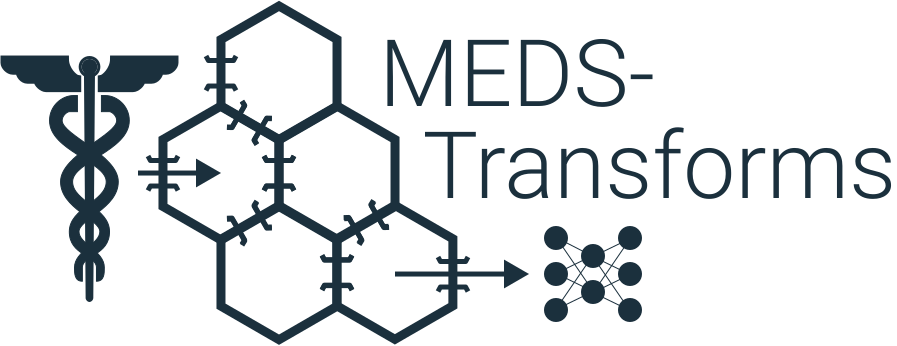

<p align="center">
  <picture>
    <source media="(prefers-color-scheme: dark)" srcset="static/logo_dark.svg">
    <source media="(prefers-color-scheme: light)" srcset="static/logo_light.svg">
    
  </picture>
</p>

# MEDS Transforms: Build and run complex pipelines over MEDS datasets via simple parts

[](https://pypi.org/project/MEDS-transforms/)

[](https://medical-event-data-standard.github.io/)
[](https://meds-transforms.readthedocs.io/en/latest/?badge=latest)
[](https://codecov.io/gh/mmcdermott/MEDS_transforms)
[](https://github.com/mmcdermott/MEDS_transforms/actions/workflows/tests.yml)
[](https://github.com/mmcdermott/MEDS_transforms/actions/workflows/code-quality-main.yaml)
[](https://hydra.cc/)
[](https://github.com/mmcdermott/MEDS_transforms#license)
[](https://github.com/mmcdermott/MEDS_transforms/pulls)
[](https://github.com/mmcdermott/MEDS_transforms/graphs/contributors)

MEDS-Transforms is a Python package for assembling complex data pre-processing workflows over MEDS datasets.
To do this, you define a pipeline as a series of stages, each with its own arguments, then run the pipeline
over your dataset. This allows the community to curate a library of shared stages for common operations, such
as filtering, normalization, outlier detection, and more, which can be used to build novel pipelines for
diverse use cases. Learn more below to see how MEDS-Transforms can help you build your data pipelines!

## 🚀 Quick Start

### 1. Install via `pip`:

```bash
pip install MEDS-transforms
```

### 2. Craft a pipeline YAML file:

```yaml
input_dir: $MEDS_ROOT
output_dir: $PIPELINE_OUTPUT

description: Your special pipeline

stages:
  - filter_subjects:
      min_events_per_subject: 5
  - add_time_derived_measurements:
      age:
        DOB_code: MEDS_BIRTH
        age_code: AGE
        age_unit: years
      time_of_day:
        time_of_day_code: TIME_OF_DAY
        endpoints: [6, 12, 18, 24]
  - fit_outlier_detection:
      _base_stage: aggregate_code_metadata
      aggregations:
        - values/n_occurrences
        - values/sum
        - values/sum_sqd
  - occlude_outliers:
      stddev_cutoff: 1
  - fit_normalization:
      _base_stage: aggregate_code_metadata
      aggregations:
        - code/n_occurrences
        - code/n_subjects
        - values/n_occurrences
        - values/sum
        - values/sum_sqd
  - fit_vocabulary_indices
  - normalization
```

This pipeline will:

1. Filter subjects to only those with at least 5 events (unique timestamps).
2. Add codes and values for the subject's age and the time-of-day of each unique measurement.
3. Fit statistics to recognize and occlude outliers over the numeric values.
4. Remove numeric values that are more than 1 standard deviation away from the mean.
5. Fit statistics to normalize the numeric values.
6. Assign codes to unique vocabulary indices in preparation for modeling.
7. Normalize the codes and numeric values to proper numeric form for modeling.

Save your pipeline YAML file on disk at `$PIPELINE_YAML`.

### 3. Run the pipeline

In the terminal, run

```bash
MEDS_transform-pipeline pipeline_config_fp="$PIPELINE_YAML"
```

After you do, you will see output files stored in `$PIPELINE_OUTPUT` with the results of each stage of the
pipeline, stored in stage specific directories, and the global output in `$PIPELINE_OUTPUT/data` and
`$PIPELINE_OUTPUT/metadata` (for data and metadata outputs, respectively). That's it!

### 4. Do even more!

Beyond just running a simple pipeline over the built-in stages, you can also do things like

1. Define your own stages or use stages from other packages!
2. Run your pipeline in parallel or across a slurm cluster with stage specific compute and memory
    requirements!
3. Use meta-stage functionality like Match-Revise to dynamically control how your stage is run over
    different parts of the data!

To understand these capabilities and more, read the full documentation.

## Examples of MEDS-Transforms in Action:

See any of the below projects to understand how to use MEDS-Transforms in different ways!

1. [MEDS-Extract](https://github.com/mmcdermott/MEDS_extract/)
2. [MEDS TorchData](https://meds-torch-data.readthedocs.io/en/latest/)
3. [Simple Example Package](https://github.com/mmcdermott/MEDS_transforms/tree/main/examples/simple_example_pkg)

> [!NOTE]
> If your package uses MEDS-Transforms, please submit a PR to add it to this list!

## Detailed Documentation

Read the full [API documentation](https://meds-transforms.readthedocs.io/en/latest//api/MEDS_transforms/) for
technical details

### Design Philosophy

MEDS-Transforms is built around the following design philosophy:

#### The MEDS format

MEDS-Transforms is built for use with [MEDS datasets](https://medical-event-data-standard.github.io/). This
format is an incredibly simple, usable, and powerful format for representing electronic health record (EHR)
datasets for use in machine learning or artificial intelligence applications.

#### Pipelines are Composed from Modular Stages

Any complex data pre-processing pipeline should be expressible as a series of simpler, interoperable stages.
Expressing complex pipelines in this way allows the MEDS community to curate a library of "pre-processing
stages" which can be used within the community to build novel, complex pipelines.

#### Stages should be Simple, Testable, and Interoperable

Each stage of a pipeline should be simple, testable, and (where possible) interoperable with other stages.
This helps the community ensure correctness of pipelines and develop new tools in an efficient, reliable
manner. It also helps researchers break down complex operations into simpler conceptual pieces. See the
[documentation on MEDS-Transforms Stages](<>) for more details on how to define your own stages!

#### Pipelines should be Defined via Readable, Comprehensive Configuration Files

Complex pipelines should also be communicable to other researchers, so that we can easily reproduce others'
results, understand their work, and iterate on it. This is best enabled when pipelines can be defined by
clear, simple configuration files over this shared library of stages. MEDS-Transforms realizes this with our
pipeline configuration specification, shown above. See [the full pipeline configuration documentation](<>) for
more details.

#### Pipelines should Scale with Compute Resources to Arbitrary Dataset Sizes

Just as the MEDS format is designed to enable easy scaling of datasets through sharding, MEDS-Transforms is
built around a mapreduce paradigm to enable easy scaling of pipelines to arbitrary dataset sizes by
parallelizing operations across the input datasets' shards. Check out
[the mapreduce helpers](<>) MEDS-Transforms exposes for your use in downstream pipelines.

#### Data is the Interface

Much as MEDS is a data standard, MEDS-Transforms tries to embody the principle that data, rather than python
objects, should be the interface between various pipeline components as much as possible. To that end, each
MEDS-Transform stage can be run as a standalone script outputting transformed files to disk, which subsequent
stages read. This means that you can easily run multiple MEDS-Transforms pipelines in sequence to combine
operations across different packages or use-cases, and seamlessly resume pipelines after interruptions or
failures from the partially completed stage outputs.

> [!NOTE]
> This does cause some performance limitations, which we are solving; follow
> [Issue #56](https://github.com/mmcdermott/MEDS_transforms/issues/56) to track updates on this!

### Running MEDS-Transforms Pipelines

#### Parallelization

MEDS-Transforms pipelines can be run in serial mode or with controllable parallelization via Hydra launchers.
The use of Hydra launchers and the core design principle of this library means that this parallelization is as
simple as launching the individual stages multiple times with near-identical arguments to spin up more workers
in parallel, and they can be launched in any mode over a networked file-system that you like. For example,
default supported modes include:

- Local parallelism via the `joblib` Hydra launcher, which can be used to run multiple copies of the same
    script in parallel on a single machine.
- Slurm parallelism via the `submitit` Hydra launcher, which can be used to run multiple copies of the
    same script in parallel on a cluster.

> [!NOTE]
> The `joblib` and `submitit` Hydra launchers are optional dependencies of this package. To install them, you
> can run `pip install MEDS-transforms[local_parallelism]` or
> `pip install MEDS-transforms[slurm_parallelism]`, respectively.

### Building MEDS-Transforms Pipelines

#### Defining your own stages

##### Overview

MEDS-Transforms is built for you and other users to define their own stages and export them in your own
packages. When you define a stage in your package, you simply "register" it as a
`MEDS_transforms.stages.Stage` object via a `MEDS_transforms.stages` plugin in your package's entry points,
and MEDS-Transforms will be able to find it and use it in pipelines, tests, and more.

Concretely, to define a function that you want to run as a MEDS-Transforms stage, you simply:

###### 1. Use the `Stage.register` helper:

E.g., in `my_package/my_stage.py`:

```python
from MEDS_transforms.stages import Stage


@Stage.register
def main(cfg: DictConfig):
    # Do something with the MEDS data
    pass
```

###### 2. Add your stage as a `MEDS_transforms.stages` entry point:

E.g., in your `pyproject.toml` file:

```toml
[project.entry-points."MEDS_transforms.stages"]
my_stage = "my_package.my_stage:main"
```

##### Stage types

MEDS-Transforms supports several different types of stages, which are listed in the
`StageType` `StrEnum`. These are:

1. `MAP` stages, which apply an operation to each data shard in the input, and save the output to the same
    shard name in the output folder.
2. `MAPREDUCE` stages, which apply a _metadata extraction_ operation to each shard in the input, then reduce
    those outputs to a single metadata file, which is merged with the input metadata and written to the
    output.
3. `MAIN` stages, which do not fall into either of the above categories and are simply run as standalone
    scripts without additional modification. `MAIN` stages cannot use things like the "Match-Revise"
    protocol.

`MAP` and `MAPREDUCE` stages take in map and reduce functions; these functions can be direct functions that
apply to each shard, but more commonly they are "functors" that take as input the configuration parameters or
other consistently typed and annotated information and build the specific functions that are to be applied.
MEDS-Transforms can reliably bind these functors to the particular pipeline parameters to streamline your
ability to register stages. See the `bind_compute_fn` function to better understand how this works and how to
ensure your stages will be appropriately recognized in downstream usage.

##### Stage registration configuration

Stages are registered via the `Stage.register` method, which can be used as a function or a decorator.

#### Defining your own pipelines

In addition to writing your own scripts, you can also allow users to reference your pipeline configuration
files directly from your package by ensuring they are included in your packaged files. Users can then refer to
them by using the `pkg://` syntax in specifying the pipeline configuration file path, rather than an absolute
path on disk. For example:

```bash
MEDS_transform-pipeline pipeline_fp="pkg://my_package.my_pipeline.yaml"
```

#### Meta-stage functionality

Currently, the only supported meta-stage functionality is the "Match-Revise" protocol, which allows you to
dynamically control how your stage is run over different parts of the data. This is useful for things like
extraction of numerical values based on a collection of regular expressions, filtering different subsets of
the data with different criteria, etc.

#### Testing Support

Given the critical importance of testing in the MEDS-Transforms library, we have built-in support for you to
test your derived stages via a semi-automated, clear pipeline that will aid you in both writing tests and
ensuring your stages are understandable to your users.

### Example plugin package

This repository includes a minimal example of a downstream package that depends
on MEDS-Transforms. You can find it under
[`examples/simple_example_pkg`](https://github.com/mmcdermott/MEDS_transforms/tree/main/examples/simple_example_pkg).
The package registers an `identity_stage` via an entry point and ships a simple
`identity_pipeline.yaml` that exercises the stage. After installing the package
locally you can run the pipeline with

```bash
MEDS_transform-pipeline pipeline_fp="pkg://simple_example_pkg.pipelines/identity_pipeline.yaml"
```

See `tests/test_example_pkg.py` for an automated demonstration of this setup.

## Roadmap & Contributing

MEDS-Transforms has several key current priorities:

1. Improve the quality of the documentation and tutorials.
2. Improve the performance of the library, especially eliminating the fact that all stages currently write
    to disk and read from disk and that polars is not as efficient in low-resource settings.
3. Improve the usability and clarity of the core components of this library, both conceptually and
    technically; this includes things like removing the distinction between data and metadata stages,
    ensuring all stages have a clear output schema, supporting reduce- or metadata- only stages, etc.
4. Supporting more parallelization and scheduling systems, such as LSF, Spark, and more.

See the [GitHub Issues](https://github.com/mmcdermott/MEDS_transforms/issues) to see all open issues we're
considering. If you have an idea for a new feature, please open an issue to discuss it with us!

Contributions are very welcome; please follow the
[MEDS Organization's Contribution
Guide](https://github.com/Medical-Event-Data-Standard/.github/blob/main/CONTRIBUTING.md) if you submit a PR.
